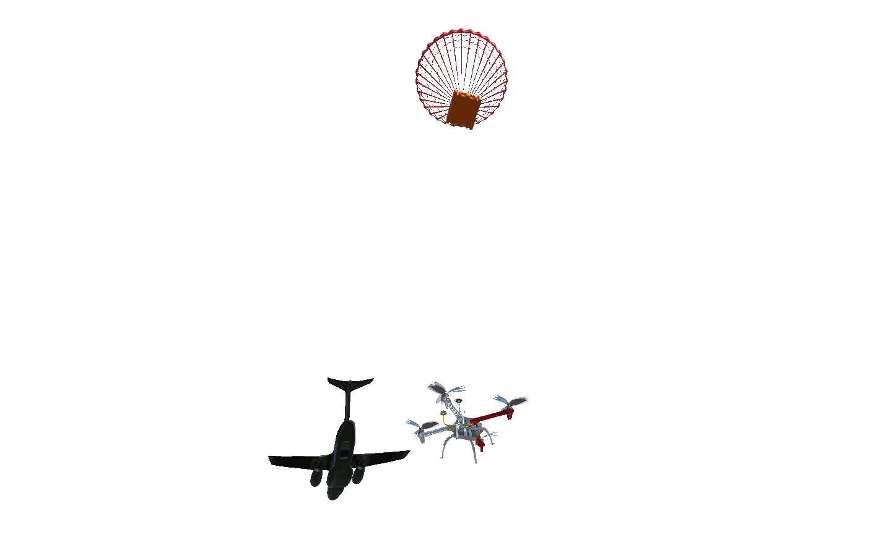

# NoFire Squad Project

## 2nd SARC-BARINet Simulation in Unity

 

<!--  
 -->

Unity scene and scripts of the NoFire Squad Project to the [2nd SARC-BARINet competition][link_sarc_page].

This Unity project consists of a scene and scripts to illustrate some phases
of the mission proposed. **The physics-based simulation was performed in Gazebo and can be
found in the repository of the SEMEAR Group**, [Grupo-SEMEAR-USP/SARC2022][link_noFireSquad_repo].

---

[link_sarc_page]:[https://sarc.center/2nd-sarc-barinet-aerospace-competition/]

[link_noFireSquad_repo]: https://github.com/Grupo-SEMEAR-USP/SARC2022

## Phases of the mission implemented in Unity (for illustration purposes only):

### **Aircraft Airdrop** 

### **Fire Detection** (python + Unity)

  

<!--   -->

### **Swarm formation** 

## Features:

- [x] Aircraft flight
- [ ] Aircraft control
- [x] Propeller rotation 
- [x] Fire spots instances
- [x] smoke effect
- [ ] Fire propagation
- [x] Swarm formation
- [ ] Swarm trajectories and movements

